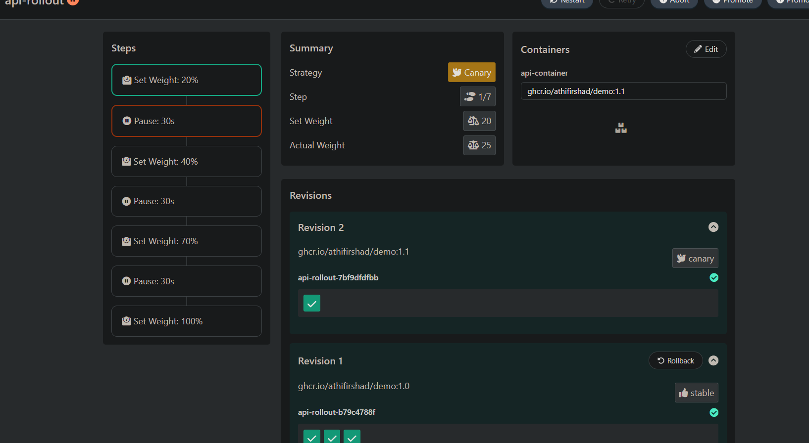

# K8s, Argo CD and Argo Rollout with a Docker Image

1. [Objective](#objective)
2. [Installation](#installation)
   - [MiniKube](#minikube)
   - [Kubectl](#kubectl)
   - [Argo CD](#argo-cd)
   - [Argo Rollouts](#argo-rollouts)
3. [Procedure](#procedure)
   - [Access The Argo CD API Server](#access-the-argo-cd-api-server)
   - [Login Using The CLI](#login-using-the-cli)
   - [Creating the app with Argo CD](#creating-the-app-with-argo-cd)
   - [Canary Releases](#canary-releases)
4. [Cleaning up](#cleaning-up)
5. [Difficulties I Faced](#difficulties-i-faced)

# Objective
The objective of this assignment is to gain practical experience with GitOps practices, specifically by utilizing Argo CD for continuous deployment and Argo Rollouts for advanced deployment strategies within a Kubernetes environment. The hands-on experience will involve setting up a GitOps pipeline that automates the deployment and management of a simple web application, thereby enhancing the efficiency and reliability of software delivery processes.

We will be using a docker image thats a golang application that does absolutely nothing but return a version number to the web. Its meant to be an example the use of docker images in the pipeline.

# Installation:

## MiniKube

Minikube is a tool that makes it easy to run Kubernetes locally. Minikube runs a single-node Kubernetes cluster on your personal computer so you can try out Kubernetes, or for daily development work.

Installation steps are pretty straightford and is available at [https://minikube.sigs.k8s.io/docs/start/](ghttps://minikube.sigs.k8s.io/docs/start/) for Linux, MacOS and Windows.

However since Argo Rollouts is not natively available in Windows (something I found out too late), working with WSL2 is possible instead of dealing with a docker image. Using the instructions for linux will lead to certificate and plethora of other errors. Instead use the instructions [here](https://gist.github.com/wholroyd/748e09ca0b78897750791172b2abb051) and it lead you to a smooth install.

## Kubectl

If you followed the gist to install MiniKube in WSL2, you can skip this section and move to ArgoCD.

Installation of Kubectl is pretty straightford and the instructions can be found [here.](https://kubernetes.io/docs/tasks/tools/)

## Argo CD

```bash
kubectl create namespace argocd
kubectl apply -n argocd -f https://raw.githubusercontent.com/argoproj/argo-cd/stable/manifests/install.yaml
```

This will create a new namespace, `argocd`, where Argo CD services and application resources will live.

Download the latest Argo CD version from [https://github.com/argoproj/argo-cd/releases/latest](https://github.com/argoproj/argo-cd/releases/latest). More detailed installation instructions can be found via the [CLI installation documentation](cli_installation.md).

Also available in Mac, Linux and WSL Homebrew:

```bash
brew install argocd
```

## Argo Rollouts

We can install Argo Rollouts by running:

```shell
kubectl create namespace argo-rollouts
kubectl apply -n argo-rollouts -f https://github.com/argoproj/argo-rollouts/releases/latest/download/install.yaml

```

or by following the [official documentation that you can find here](https://argoproj.github.io/argo-rollouts/installation/#controller-installation).

You also need to install the [Argo Rollouts `kubectl` plugin](https://argoproj.github.io/argo-rollouts/installation/#kubectl-plugin-installation)

# Procedure

Clone the repository to any directory

```
git clone https://github.com/athifirshad/k8s-demo && cd k8s-demo
```

### Access The Argo CD API Server

By default, the Argo CD API server is not exposed with an external IP. To access the API server,

```bash
kubectl port-forward svc/argocd-server -n argocd 8080:443
```

The API server can then be accessed using https://localhost:8080

### Login Using The CLI

The initial password for the `admin` account is auto-generated and stored as
clear text in the field `password` in a secret named `argocd-initial-admin-secret`
in your Argo CD installation namespace. You can simply retrieve this password
using the `argocd` CLI:

```bash
argocd admin initial-password -n argocd
```

Login to the interface using the provided credentials. Also login to the argocd cli tool. You will need it later to delete all the resources.

```bash
argocd login localhost:8080
```

# Creating the app with Argo CD

We now need to create an app for the deployment and service:

```bash
 kubectl apply -f k8s/argo.yml
```

It should be visible on the argo dashboard -


```bash
 kubectl apply -f k8s/rollout.yml
```

You can also the kubernetes dashboard by executing the command below which will return a link:

```bash
 minikube dashboard
```

Use ` minikube tunnel` to expose the application. You can view the "web app" at [localhost:4000](http://localhost:4000). You should see the current version number. This method is not recommended, using an ingress is the standard for production.

Your dashboard should look similiar to this -


We have successfully deployed the Kubernetes application. According to the configuration in [rollout.yml](./k8s/rollout.yml), there are 3 replicas which is why 3 pods are visible on the dashboards.

### What ArgoCD does

Argo CD and Kubernetes work together to make deploying and managing applications automated. When you make changes to your application's configuration in Git, Argo CD automatically updates your Kubernetes cluster to match. This is all thanks to a process called "synchronization."

Argo CD also has a self-healing feature. If something goes wrong and your cluster gets out of sync with your Git repository, Argo CD steps in to fix it. It's all pretty cool.

# Canary Releases

Start a local version of the Argo Rollouts Dashboard by running in a new terminal the following command:

```shell
kubectl argo rollouts dashboard
```

Then you can access the dashboard by pointing your browser to [http://localhost:3100/rollouts](http://localhost:3100/rollouts)

The dashboard should look similiar to this 

The first rollout is the intial rollout. Subsequent rollouts will be following the Canary release strategy as defined in [rollout.yml](./k8s/rollout.yml)

```yaml
strategy:
  canary:
    steps:
      - setWeight: 20
      - pause: { duration: "30s" }
      - setWeight: 40
      - pause: { duration: "30s" }
      - setWeight: 70
      - pause: { duration: "30s" }
      - setWeight: 100
    canaryService: api-canary
    stableService: api-stable
```

Basically only 20% of the requests get redirected to the new release. The remaining 80% remain with the previous release or the "stable" release. Then 40% of requests after 30 secs, then 70% after 30 secs and finally 100%. From my very limited knowledge, this is done in tandem commonly with live analytics like prometheus to stop the rollout and rollback. It's basically testing in production.

Now let's make a new release by updating the [rollout.yml](./k8s/rollout.yml) to use a newer image `demo:1.1`.

[rollout.yml](./k8s/rollout.yml) should look like this -

```yaml
apiVersion: argoproj.io/v1alpha1
kind: Rollout
metadata:
  name: api-rollout
spec:
  replicas: 3
  selector:
    matchLabels:
      app: api
  template:
    metadata:
      labels:
        app: api
    spec:
      containers:
        - name: api-container
          image: ghcr.io/athifirshad/demo:1.1
          resources:
            requests:
              memory: "64Mi"
              cpu: "250m"
            limits:
              memory: "128Mi"
              cpu: "500m"
          ports:
            - containerPort: 4000
  strategy:
    canary:
      steps:
        - setWeight: 20
        - pause: { duration: "30s" }
        - setWeight: 40
        - pause: { duration: "30s" }
        - setWeight: 70
        - pause: { duration: "30s" }
        - setWeight: 100
      canaryService: api-canary
      stableService: api-stable
```

Commit and pushing to the repo will automatically update the kubernetes deployments thanks to Argo CD's synchronization.
Your Argo Rollouts dashboard should look like this


A new pod was created. One of the previous release pods will be terminated.

Your Argo CD dashboard will look like this showing 2 pods for the previous release and one for the canary release


After the duration of the canary release which is set to 90 secs, all previous release pods will be terminated and the end result should be this signifying a successful release.


If you use `kubectl get pods` in terminal you will see that each pods has been created with a 30 secs difference showing the staggered release.

You can rollback in the argo rollout dashboard, and watch the entire process happen again in reverse.

Pretty cool stuff.

# Cleaning up

Let's delete the rollouts -

```bash
kubectl delete rollout api-rollout
```

Deleting the app from Argo CD -

```bash
argocd app delete api --cascade
```

Everything should be gone at this point.
Stop the terminals that is used for portforwarding and `minikube tunnel`.
You can delete this instance of minikube with -

```bash
minikube delete
```

# Difficulties I Faced

### Knowledge Gap 

 I had a somewhat vague idea of how kubernetes worked and I had no idea on how to use it. For this assignment, the 3 days I had gotten, majority was spent on learning and research. I had read many articles and watched couple of vides. However to truely grok the concepts, I referred the following books -

[Platform Engineering on Kubernetes By Mauricio Salatino](https://learning.oreilly.com/api/v1/continue/9781617299322/)

[Kubernetes: Up and Running, 3rd Edition By Brendan Burns, Joe Beda, Kelsey Hightower, Lachlan Evenson](https://learning.oreilly.com/library/view/kubernetes-up-and/9781098110192/)

I spent more time learning than coding. 

